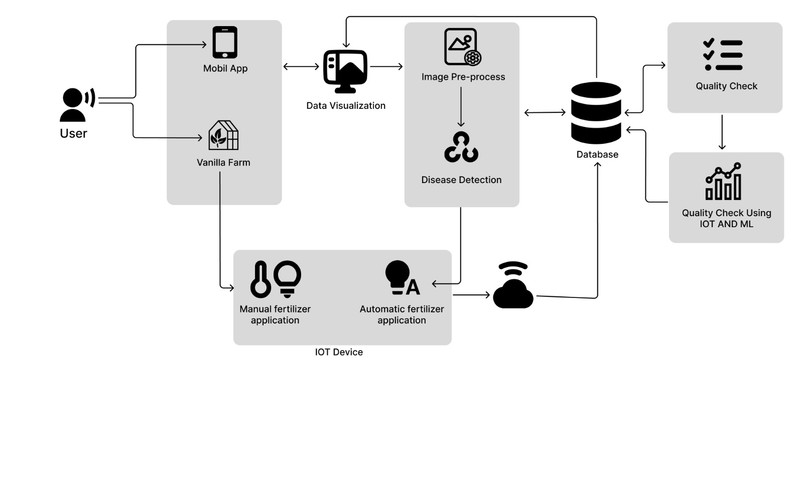

# IT4010-Vanilla--Research

# 🌱 Advanced Vanilla Cultivation & Quality Management System
**BSc (Hons) in Information Technology – Final Year Research Project** *Sri Lanka Institute of Information Technology (SLIIT)* *Project ID: TMP-2025-26J-415*

---

---

## 📖 Project Overview
This project introduces a comprehensive **AgriTech solution** designed to modernize the cultivation, management, and quality assessment of *Vanilla planifolia*. Traditional vanilla farming in Sri Lanka faces challenges such as labor-intensive pollination, inconsistent grading, inefficient resource usage, and disease outbreaks.

The proposed system integrates **Internet of Things (IoT), Computer Vision, and Machine Learning** to create an automated ecosystem. It manages the entire lifecycle of the vanilla crop—from precise environmental control and disease detection to optimal pollination timing and post-harvest quality grading.

---

## 🏗️ Architectural Diagram

<!-- 

  
   
  
  <em>Figure 1: High-level System Architecture integrating IoT Sensors, Cloud Analytics, and Mobile Interfaces</em>

---

## ⚙️ System Workflow
The system operates through four interconnected intelligent modules:

---

### 1. Smart Greenhouse & Fertigation Management
#### **1.1 Overview**
This component focuses on automating the environmental control and nutrient delivery for vanilla vines. It replaces manual farming practices with an IoT-driven approach that regulates soil moisture, pH, light intensity, and humidity.

> [!NOTE]
> This module is designed to optimize resource usage, specifically water and fertilizer, ensuring sustainable cultivation practices.

#### **1.2 Key Features**
* **Automated Fertigation:** Controls solenoid valves and pumps to deliver precise nutrient mixes based on real-time soil NPK and EC sensor data.
* **Environmental Control:** Automatically triggers exhaust fans, grow lights, and irrigation based on DHT22 and LDR sensor readings.
* **Yield Prediction:** Uses Machine Learning to analyze historical sensor data and forecast crop yield and growth patterns.

#### **1.3 Tech Stack**
* **Hardware:** ESP32, NPK Sensors, pH Sensors, Solenoid Valves, Relay Modules.
* **Software:** Arduino IDE, Python (ML models), Firebase (Real-time DB).

---

### 2. Disease Detection & Health Analysis
#### **2.1 Overview**
A mobile-based solution designed to identify and categorize pests and diseases affecting *Vanilla planifolia*. It utilizes Deep Learning to analyze leaf images captured by farmers, providing instant diagnosis and treatment recommendations.

#### **2.2 Detection Capabilities**
The system uses **Convolutional Neural Networks (CNN)** to detect specific conditions:
* **Fungal Diseases:** *Pestalotiopsis*, Anthracnose, *Fusarium Oxysporum* (Root rot).
* **Pest Infestations:** Identification of common vanilla pests.
* **Nutrient Deficiencies:** Visual indicators of plant stress.

#### **2.3 Workflow**
1.  **Image Capture:** User captures an image via the mobile app.
2.  **Preprocessing:** Noise removal and feature extraction.
3.  **Classification:** CNN model classifies the disease stage.
4.  **Response:** The app displays the diagnosis and preventive measures.

---

### 3. Growth Stage & Harvest Optimization
#### **3.1 Overview**
This module serves as a decision support platform for the critical operational stages of vanilla farming. It leverages Computer Vision to eliminate the guesswork in determining when to perform specific manual interventions.

> [!NOTE]
> This component addresses the "research gap" regarding the lack of automated phenological monitoring for vanilla.

#### **3.2 Intelligent Functions**
| Function | Description |
| :--- | :--- |
| **Vine Stress Detection** | Analyzes leaf color and texture to signal the optimal time for vine stressing (to induce flowering). |
| **Pollination Window** | Monitors blossom morphology to identify the exact timeframe for manual pollination. |
| **Harvest Readiness** | Detects bean pigmentation changes (yellowing at tips) to predict the perfect harvest time for maximum Vanillin content. |

#### **3.3 Future Works**
* Integration with robotic end-effectors for automated pollination.
* Real-time alerts via SMS for remote farmers without data access.

---

### 4. Quantity & Quality Measurement
#### **4.1 Overview**
An automated grading system that evaluates harvested vanilla beans. It replaces subjective manual inspection with an AI-driven approach that correlates physical appearance with chemical quality indicators.

#### **4.2 Grading Parameters**
The system analyzes beans based on non-destructive imaging to predict:
* **Physical Metrics:** Length, Diameter, Curvature, and Surface Texture (using CV).
* **Chemical Indicators:** Predicting **Vanillin Content** and **Moisture Levels** based on visual features (using Regression Models).
* **Defect Detection:** Identifies splits, mold, or fungal infections on cured beans.

#### **4.3 Value Estimation**
By combining the physical grade (A, B, C) with the predicted chemical quality, the system provides a standardized quality score, facilitating fair trade and reducing market disputes.

---

### 🛠️ Technical Stack

© 2025-2026 | SLIIT Faculty of Computing | Vanilla Research Group

